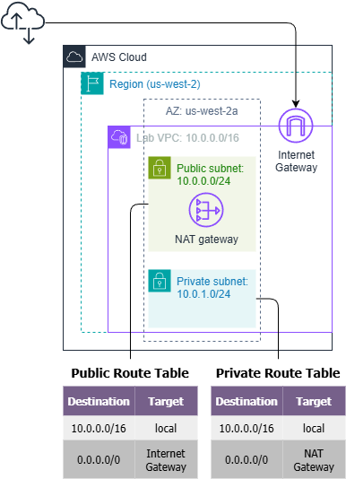
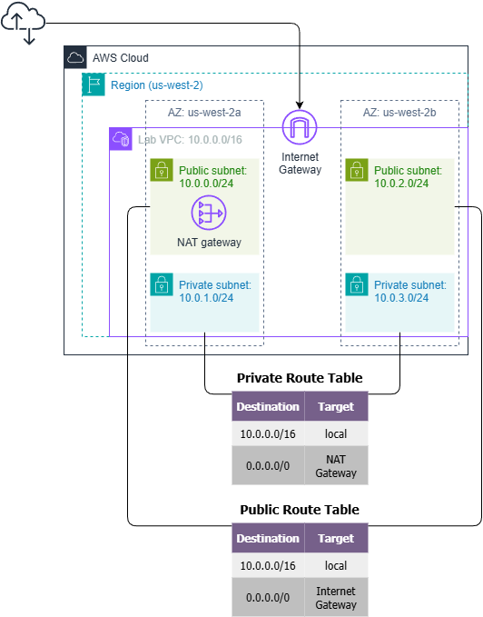
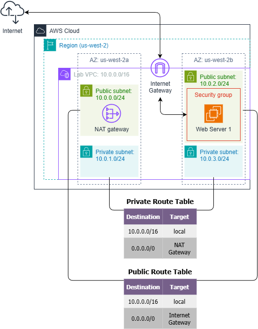

# Build Your VPC and Launch a Web Server

## Objectives

After completing this lab, you should be able to:

* Create a virtual private cloud (VPC)
* Create subnets
* Configure a security group
* Launch an Amazon Elastic Compute Cloud (Amazon EC2) instance into a VPC

## Duration

This lab takes approximately 45 minutes to complete.

## Scenario

In this lab, you use Amazon Virtual Private Cloud (VPC) to create your own VPC and add additional components to produce a customized network for a Fortune 100 customer. You also create security groups for your EC2 instance. You then configure and customize an EC2 instance to run a web server and launch it into the VPC that looks like the following customer diagram:


## Task 1: Create your VPC

1. Create a VPC:
    - **Resources to create**: VPC and more
    - **Name tag auto-generation**: Uncheck [ ] Auto-generate
    - **IPv4 CIDR**: 10.0.0.0/16
    - **IPv6 CIDR block**: No IPv6 CIDR block.
    - **Tenancy**: Default.
    - **Number of Availability Zones (AZs)**:  1
    - **Number of public subnets**:  1
    - **Number of private subnets**:  1
    - Subnets CIDR blocks:
        * **Public subnet CIDR block in us-west-2a**: 10.0.0.0/24
        * **Private subnet CIDR block in us-west-2a**: 10.0.1.0/24
    - **NAT gateways**: In 1 AZ
    - **VPC endpoints**: None

    - Names:
        * Subnets:
            - Public Subnet 1
            - Private Subnet 1
        * Route Table:
            - Public Route Table
            - Private Route Table



## Task 2: Create additional subnets

- Subnet name: Public Subnet 2
- Availability Zone: ~~No preference~~ Pick explicitly other AZ. No preference doesn't guarantee a different AZ.
- IPv4 CIDR block: 10.0.2.0/24

- Subnet name: Private Subnet 2
- Availability Zone: ~~No preference~~
- IPv4 CIDR block: 10.0.3.0/24

* Since there is no explicit Route Table Association, they are associated with the main route table, which only gives local access.
but are listed in the "Subnet without explicit associations" section.


## Task 3: Associate the subnets and add routes

- Associate Public Subnet 2 to Public Route Table
- Associate Private Subnet 2 to Private Route Table

Your VPC now has public and private subnets configured in two Availability Zones:



## Task 4: Create a VPC security group

Create a security group:
- Security group name: Web Security Group
- Description: Enable HTTP access
- VPC: Lab VPC.
- Add Inbound Rule:
    - Type: HTTP.
    - Source: Anywhere IPv4.
    - Description: Permit web requests

## Task 5: Launch a web server instance

Create an instance:
- Name: Web Server 1
- AMI: Amazon Linux 2023
- Type: t3.micro
- Key pair (login): vockey
- Network settings:
- VPC: Lab VPC
- Subnet Public Subnet 2
- Auto-assign public IP: Enable
- Firewall (security groups): Web Security Group
- User data:

    ```bash
    #!/bin/bash
    # Update and install Apache, MariaDB (replacing mysql) and PHP
    dnf install -y httpd mariadb105-server php

    # Download and extract lab files
    wget https://aws-tc-largeobjects.s3.us-west-2.amazonaws.com/CUR-TF-100-RESTRT-1/267-lab-NF-build-vpc-web-server/s3/lab-app.zip
    unzip lab-app.zip -d /var/www/html/

    # Enable Apache and start it
    systemctl enable httpd
    systemctl start httpd
    ```

Check if browser can access the instance.



# Lab Complete!