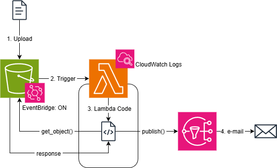

# AWS Lambda Exercise (Challenge)

1. Create an S3 Bucket
    - Activate EventBridge on the S3 Bucket, which is turned off by default to save resources and avoid flood of messages on buckets with high flux of files.

2. Create a Standard SNS Topic
    - Insert an email subscription

3. Create a Lambda Function
    - Python 3.14
    - Add the IAM Role to Lambda (LambdaAccessRole)

4. In the Lambda code, you need to connect to:
    - S3 to get the contents of the file.
    - SNS to send the customized e-mail. It's possible to just add SNS as a destination, but then it sends metadata and you can't customize the contents of the e-mail.

Check `wordCounter.py` in this repository for the Python code.

5. Add a trigger on the Lambda Function to invoke it when a new file is uploaded to the specified S3 bucket.

## Workflow

1. A file is uploaded to the S3 bucket, which has EventBridge ON to log actions.
2. The upload triggers AWS Lambda.
3. AWS Lambda runs the underlying code.
    - The code accesses S3 to get the file data, and receives it as a response.
    - You can use CloudWatch logs for code debugging.
4. The code accesses AWS SNS to activate the Topic.
5. The topic sends the e-mail.